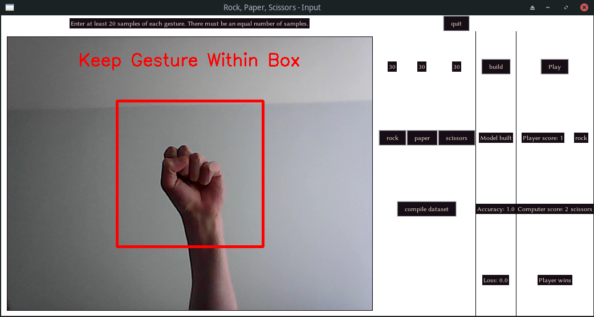

# Rock-paper-scissors game with camera controls
This is a neural network that is trained solely on a small number of gestures that the user inputs. It has a UI made with Tkinter.

## Necessary libraries to download (download with `pip install _____`)
* `keras`
* `tensorflow`
* `numpy`
* `pillow`
* `opencv-python`

You will also need `tkinter`, however this cannot be downloaded with `pip install`. If it isn't already downloaded, search how to do it on your operating system.

## Usage
To train, build and play against the model, run `input_ui.py`. You will see a UI appear with 3 main sections, separated by horizontal and vertical lines.

The first section (the top section) contains a video stream of the from your computer's camera and 4 buttons labelled 'rock', 'paper', 'scissors' and 'compile'. To build the dataset on which the model is trained, make each gesture (rock, paper or scissors) within the red box on the video stream and press the button with the respective label. Capture at least 20 samples of each gesture, moving the gesture around (**but staying within the box**) each time. After all of the samples are taken, press the compile button and move to the next section.

The second section (the bottom left section) contains a single button labelled 'build' and 3 labels. To train and build the model, press the 'build' button. The tensorflow training process (30 epochs long) will then be visible in the terminal window. Once the process is complete, the top label will say 'Model built', the middle label will show the accuracy of the model and the bottom label will show the loss of the model. Once this is done, you can move to the next section.

The third section (the bottom right section) contains a single button labelled 'play' and 5 labels. To play against the model, make a gesture within the box and press the 'play' button. The right column of labels indicate the player's and computer's respective scores. The left column of labels indicate the player's and computer's moves (the gestures that they made). The central label indicates the result of the round. The play button can be pressed repeatedly to play as many rounds as you want.

### Best practice
In order to ensure best results:
* **There have to be the same number of samples for each gesture.**
* Make sure that when taking the gesture samples, there are no other moving features (e.g. your head, another person) other than your hand within the box on the video stream. Since the samples are only taken within the box, the objects anywhere else in the frame don't really matter.
* Make sure that the conditions in which the training samples were taken are the same when you play the game. For example, make sure that the gestures you make for rock, paper and scissors are the same and make sure that the background is the same too.

## Examples:

