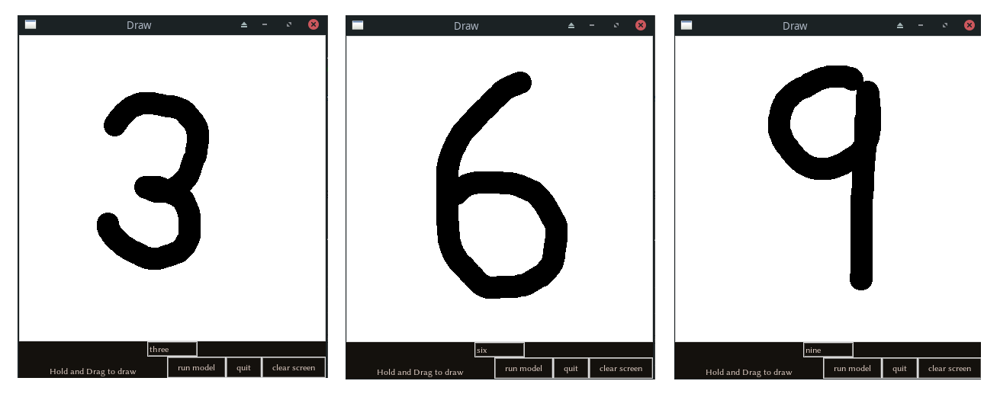

# Hand-written digit classifier
This is a neural network that is trained to classify hand-written digits from the user. It has a UI made with Tkinter and is trained on the MNIST hand-written digits dataset

## Necessary libraries to download (download with pip install _____)
* keras
* matplotlib
* numpy
* tensorflow
* tkinter
* pillow

## Usage
To evaluate the model's accuracy against digits from the MNIST hand-written digits dataset, run `evaluate_accuracy.py`. You will see the model train itself and will then be presented with the image and a graph representing which number the model think is present. To move to the next image, press 'q'. This cycle will happen 25 times.

To test the model on digits that you write, run `digit_ui.py`. You will see the model train itself and will then be presented with a small, white canvas on which you can draw your digit. Draw the digit and then press 'run model', you will see the predicted number appear (**This is currently in the terminal window**). If you want to clear the canvas, press 'clear screen'. If you want to quit, press 'quit'.

## Examples:

